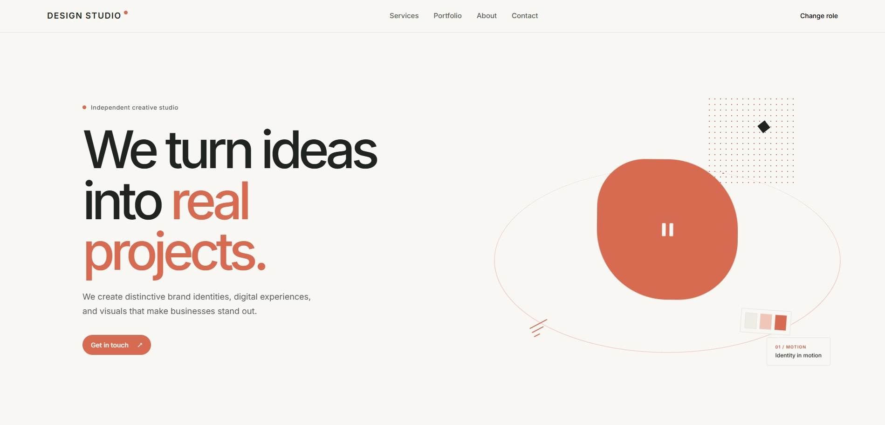
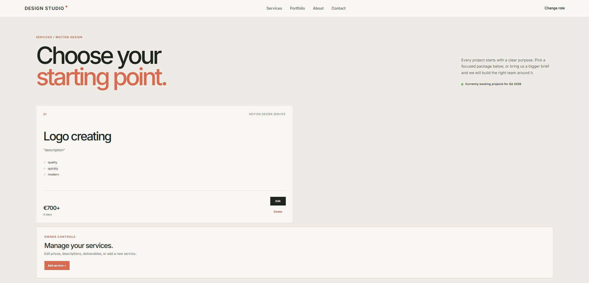
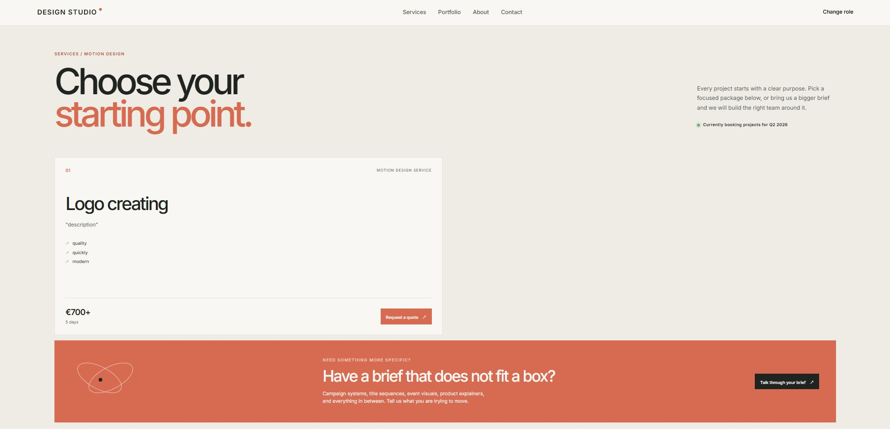

# Design Studio

Full-stack pet project for a fictional graphic design studio.

## About

Design Studio is a React + Node.js application with:

- service management
- client order form
- PostgreSQL database
- Telegram notifications

## Tech Stack

**Frontend:** React, TypeScript, Vite, CSS Modules

**Backend:** Node.js, Express, TypeScript, Prisma, PostgreSQL

**Other:** Git, GitHub, Postman, Telegram Bot API

## Features

- Client / Owner demo modes
- Services CRUD
- Order creation and validation
- PostgreSQL data storage
- Telegram order notifications
- REST API

## Screenshots

## AI-Assisted Development

The **frontend was developed fully with the help of AI**.

This was intentional: one of the goals of the project was to learn how to use AI effectively in real development — writing clear prompts, reviewing generated code, understanding it, testing it and integrating it into the project.

The **backend was developed independently**, while studying Node.js, Express, REST API, PostgreSQL, Prisma, validation and Telegram Bot API.

## Project Structure

DesignStudio-FullStack/
├── frontend/
├── backend/
├── .gitignore
└── README.md

Running Locally
git clone <https://github.com/BOgdanRoz/DesignStudio-FullStack>

cd frontend
npm install
npm run dev

cd backend
npm install
npx prisma migrate dev
npm run dev

Create .env in backend with your database and Telegram credentials.

Status:
Project completed.
